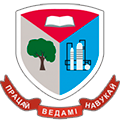
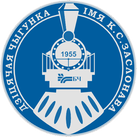

# Artsiom Belski

## Contacts

**Phone:** +375 (44) 74-64-364\
**Email:** artbelski@gmail.com\
**GitHub:** [Thrapis](https://github.com/Thrapis)\
**LinkedIn:** [artbelski](https://www.linkedin.com/in/artbelski/)\
**Location:** Minsk, Belarus

## About Me

4 years of experience in developing web and desktop applications with C#. Practical experience with SQL Databases: Oracle, Microsoft SQL Server, and Postgres. Successfully obtained Golang United School Certificate (EPAM/RS School) and continue enriching my Golang skill. Have a knowledge of OOP and widely used design patterns.

Eager to solve real business problems and thus increase the value of a
product. Motivated to learn from others and strive to be a good team
member. Detail-oriented and dedicated to delivering high-quality work.

## Education

 **Bachelor’s degree in Information Systems
and Technologies**\
*Belarusian State Technological University*\
2018 - 2022, Minsk

## Courses

 **Learning the basics of Golang and
participating in team project development**\
*Rolling Scopes School (EPAM)*\
2022, Minsk

 **Learning English - B1**\
*Underground Language Club*\
2023, Minsk

## Job Experience

 **Web Developer**\
*Belarusian State Technological University*\
Aug 2022 - July 2024 - 2 years, Minsk

 **Information Technology Instructor**\
*Children's Railway*\
Feb 2024 - Now, Minsk

## Skills

- **HTML&CSS**
- **JavaScript\TypeScript** [Basic]
- **C#** (Entity Framework, Dapper, ASP.NET Core, Blazor)
- **Java** [Basic]
- **C++** [Basic]
- **Golang** (Gorm, Gin)
- **Databases** (Oracle, MSSQL, PostgreSQL, Redis [Basic])
- **Git\GitHub** (GitHub Actions)
- **Docker** [Basic]

## Languages

- **Russian** - Native
- **Belarusian** - Native
- **English** - B1